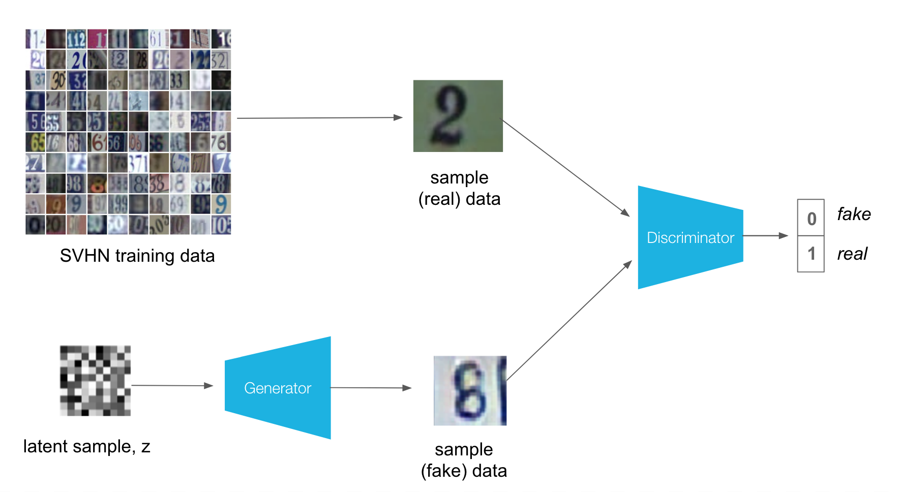

# Deep Convolutional GANs
I'm trying to build a GAN using convolutional layers in the generator and discriminator. This is called a Deep Convolutional GAN, or DCGAN for short. The DCGAN architecture was first explored in 2016 and has seen impressive results in generating new images; you can read the original paper, here.

I'll be training DCGAN on the Street View House Numbers (SVHN) dataset. These are color images of house numbers collected from Google street view. SVHN images are in color and much more variable than MNIST.

So, our goal is to create a DCGAN that can generate new, realistic-looking images of house numbers. We'll go through the following steps to do this:

Load in and pre-process the house numbers dataset
Define discriminator and generator networks
Train these adversarial networks
Visualize the loss over time and some sample, generated images
Deeper Convolutional Networks
Since this dataset is more complex than our MNIST data, we'll need a deeper network to accurately identify patterns in these images and be able to generate new ones. Specifically, we'll use a series of convolutional or transpose convolutional layers in the discriminator and generator. It's also necessary to use batch normalization to get these convolutional networks to train.

Besides these changes in network structure, training the discriminator and generator networks should be the same as before. That is, the discriminator will alternate training on real and fake (generated) images, and the generator will aim to trick the discriminator into thinking that its generated images are real!

# Results Generated by our GANS Network

