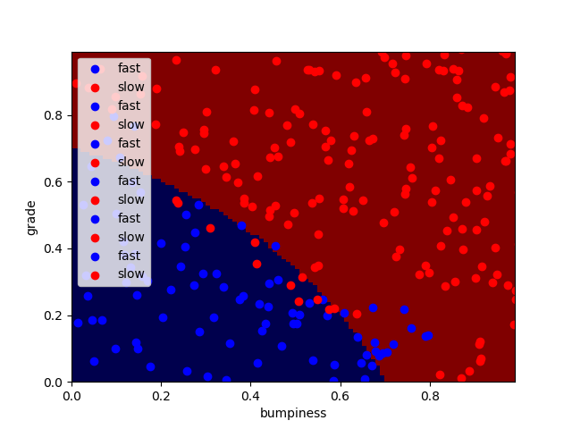

# Naive Bayes Decision line
This usecase we have created random data grade and bumpiness for slow and fast speed.
We are using NB to create decision line between slow and fast dots.

## output

Problem is taken from Udacity course.
